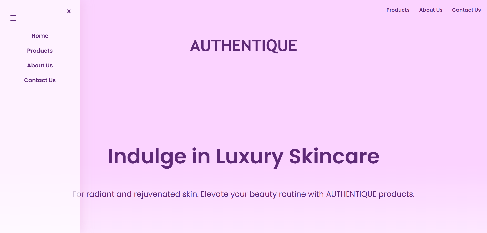
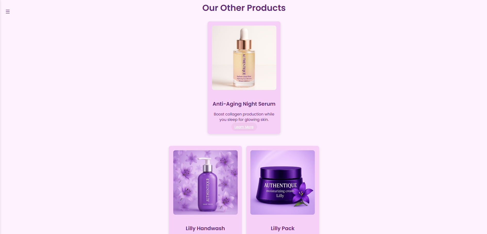
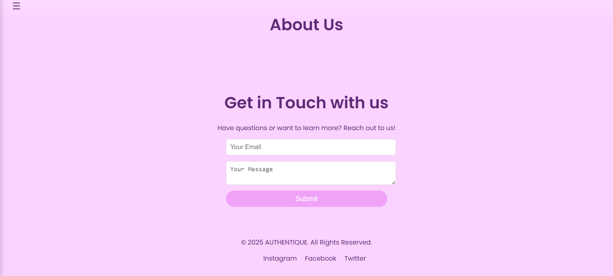

# 🌸 Authentique Cosmetic - Product Showcase Website

**Authentique Cosmetic** is a beautifully designed, responsive website built to showcase premium beauty and cosmetic products. With soft feminine colors like pink, purple, and white, the site offers a visually appealing and calming experience. It's ideal for presenting products attractively without any e-commerce or cart functionality.

---

🔗🌐 [Visit Website](https://authentique-luxury.netlify.app/) 
---

## ✨ Features

- 📱 **Fully responsive** design – works perfectly on mobile, tablet, and desktop
- 🖼️ **Product showcase** – each product includes an image and description
- 🎨 **Soft color palette** – uses gentle pinks, purples, and whites
- ⚡ **Smooth animations and transitions** – adds elegance and interactivity
- 📬 **Contact Us page** – allows users to send messages regarding products

---

## 🛠️ Tech Stack

- **Frontend & styling**: HTML5, CSS3, JavaScript
- **Hosting**: Netlify
- **Version Control**: Git & GitHub

---

## 📸 Screenshots

<!-- Add your own screenshots in the repo and link here -->

---

